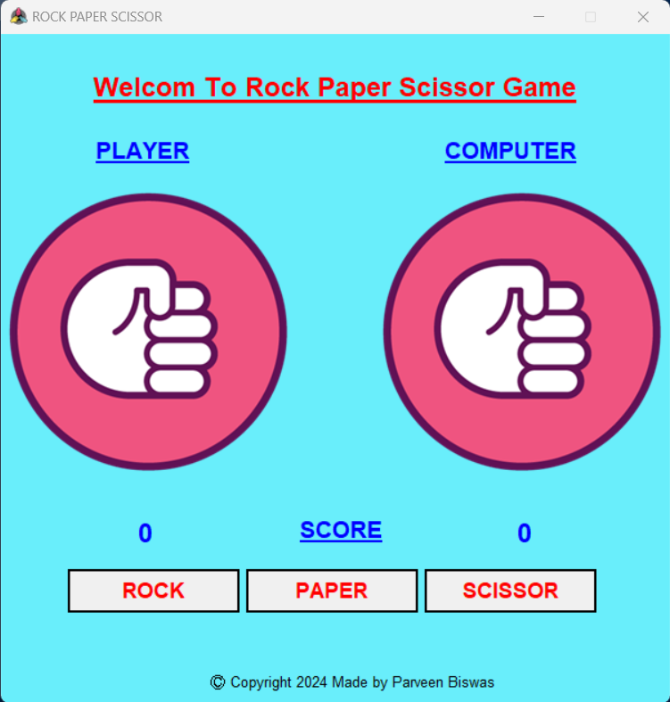
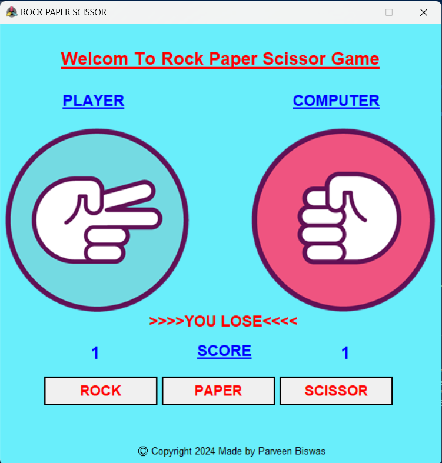
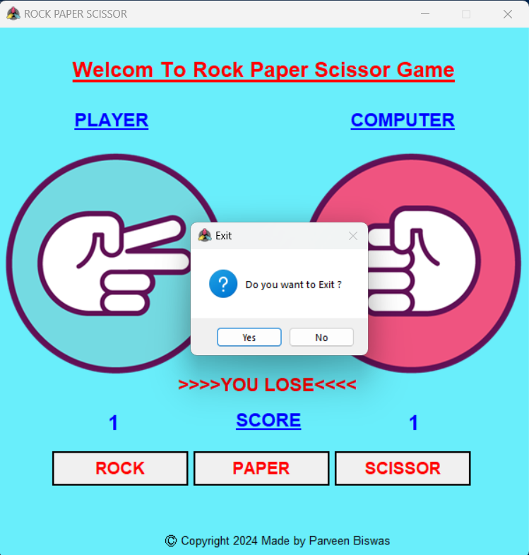

# GUI_Version_Rock_Paper_Scissor_Game
<h2>Required Packages for Build this Project</h2>
<h4>
  Tkinter
  <li>Install command : pip install tk</li> 
</h4>
<h4>
  Pillow
  <li>Install command : pip install pillow</li> 
</h4>
<h2>Design One</h2>

<h2>Design Two</h2>

